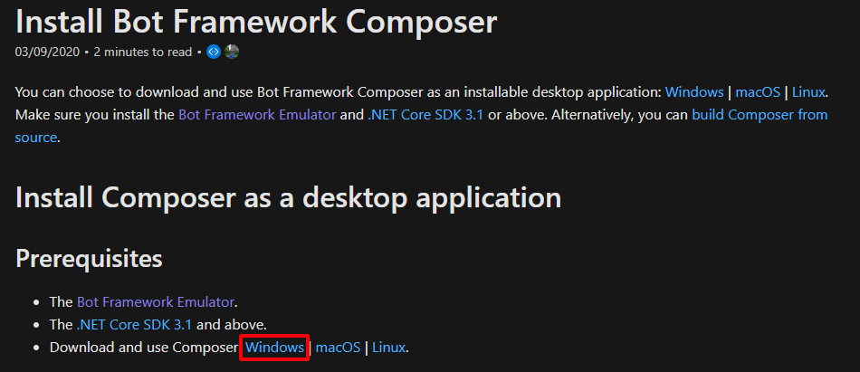
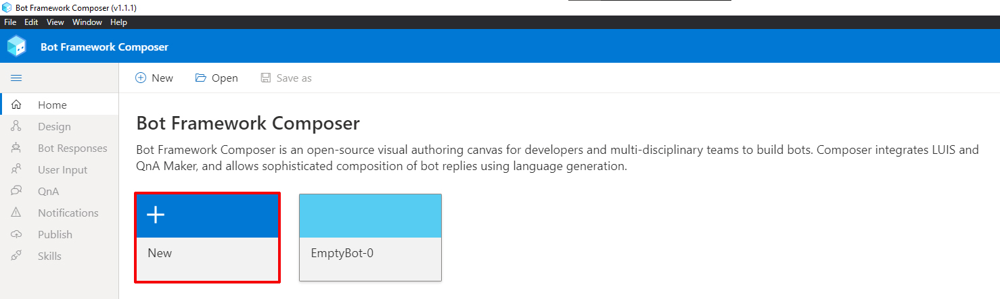
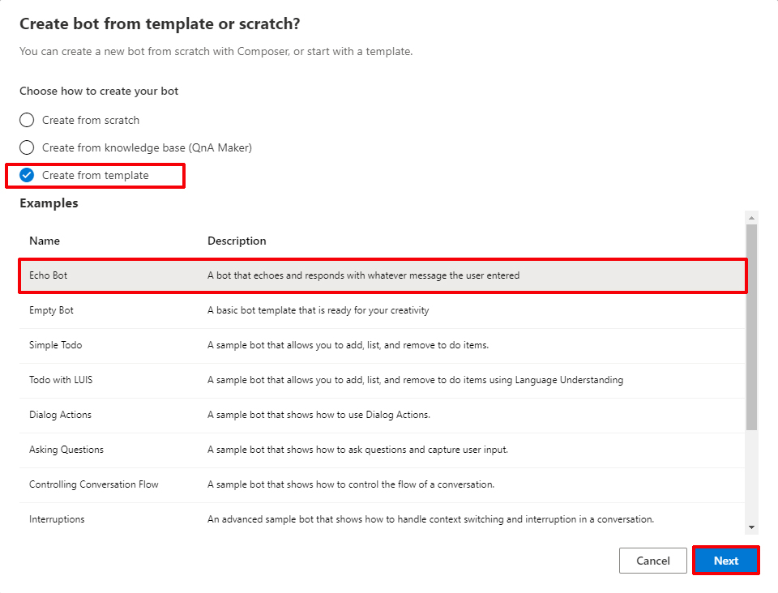
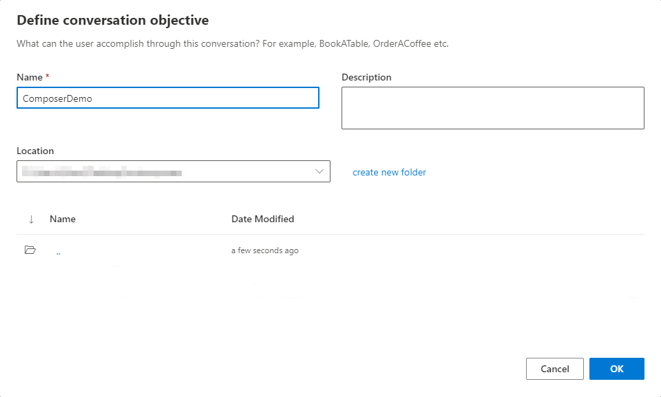
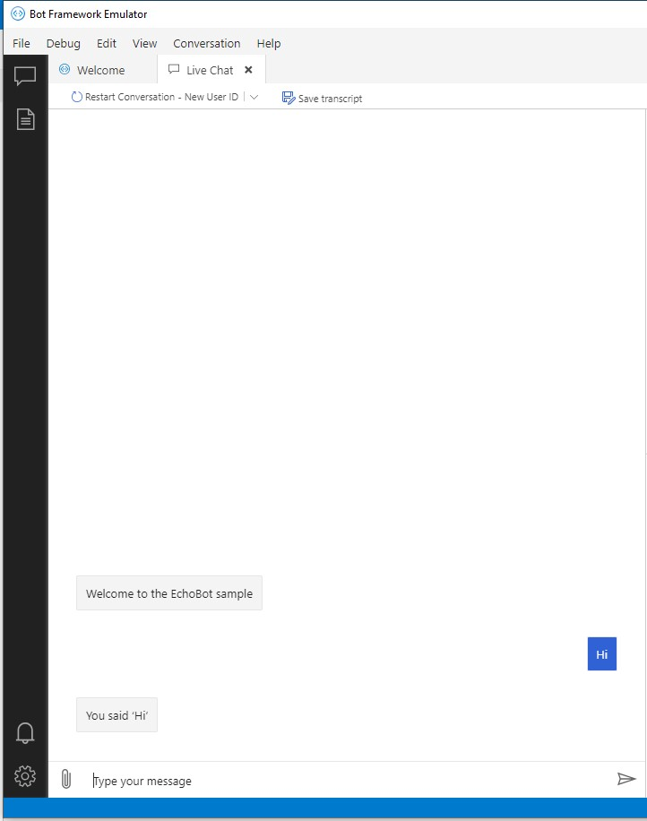

# DEMO: Creating a bot with Bot Framework Composer

## Objectives

After you complete this demo, you will be able to:
- Create simple bot with Framework Composer

## Instructions

### Before you start

#### Install Bot Framework Emulator

1. Go to https://github.com/microsoft/BotFramework-Emulator/releases/tag/v4.10.0

2. Download and install the latest **Bot Framework Emulator Framework**
   

#### Install Bot Framework Composer

> **Note:** you need the **Bot Framework Emulator Framework** and **.NET Core SDK 3.1 or above** installed

1. Go to https://docs.microsoft.com/en-gb/composer/install-composer
2. And download and install the **Bot Framework Emulator Composer**
   
> **Note:** You can download directly by clicking this **[link](https://aka.ms/bf-composer-download-win)**

#### Creating your first bot

1. Open the **Bot Framework Emulator Composer**
2. Click on **New** button
    
3. Check the **Create from template** option, select **Echo Bot** and click on **Next**
    
4. Set **ComposerDemo** as name then click on **OK**
   
5. Click on **Start Bot** at the top right wait until the bot is ready then click on **Test in Emulator** your bot emulator will open
6. Interact with the bot
   