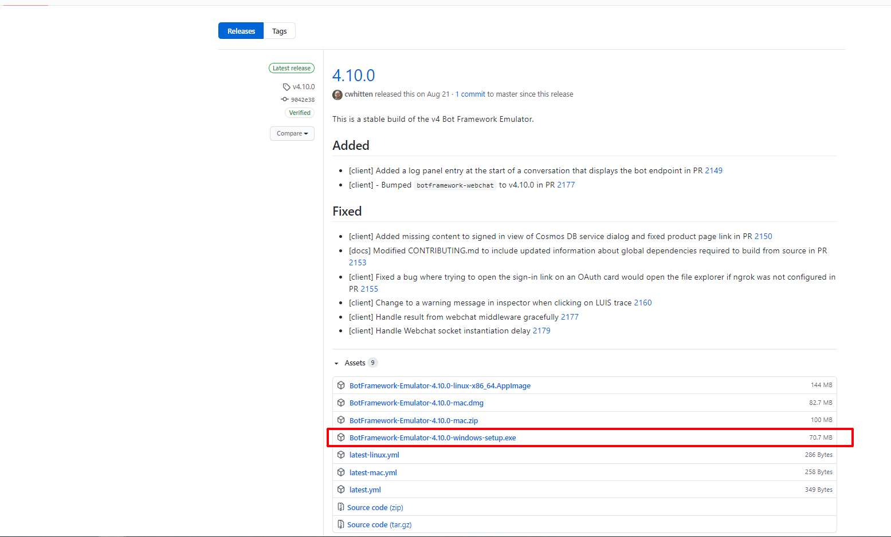
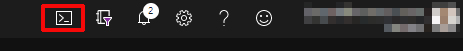

# DEMO: Creating a bot with Bot Framework Composer

## Objectives

After you complete this demo, you will be able to:
- Create simple bot with Framework Composer
- Publish your Bot

## Instructions

### Before you start

#### Install Bot Framework Emulator

1. Go to https://github.com/microsoft/BotFramework-Emulator/releases/tag/v4.10.0

2. Download and install the latest **Bot Framework Emulator Framework**
   

#### Install Bot Framework Composer

> **Note:** you need the **Bot Framework Emulator Framework** and **.NET Core SDK 3.1 or above** installed

1. Go to https://docs.microsoft.com/en-gb/composer/install-composer
2. And download and install the **Bot Framework Emulator Composer**
   
> **Note:** You can download directly by clicking this **[link](https://aka.ms/bf-composer-download-win)**

#### Exercise 1: Creating your first bot

1. Open the **Bot Framework Emulator Composer**
2. Click on **New** button
    
3. Check the **Create from template** option, select **Echo Bot** and click on **Next**
    
4. Set **ComposerDemo** as name then click on **OK**
    
5. Click on **Start Bot** at the top right wait until the bot is ready then click on **Test in Emulator** your bot emulator will open

6. Send a message and see what happens


7. Close the **Emulator**, we will customize our bot
8. Add some welcome messages in the **Bot responses menu** 
    
9. Return to the design menu and edit the response, click on design, click on *Unknown intent* then click on the **Send a response** box and customize your message
    
10. Test your bot with the emulator and see your changes
    

#### Exercise 2: Publish your bot

##### Task 1: Open the Azure portal

1.  Sign in to the Azure portal (<https://portal.azure.com>).

    > **Note:** If this is your first time signing in to the Azure portal, a dialog box will display offering a tour of the portal. Select **Get Started** to skip the tour.

##### Task 2: Create a web app bot

1. Click on **Create a resource** and search *Web app bot*

---


---
2. Create a new web App bot with the following details:
   - Bot handle: **demobot[yourname]**
   - New Resource group: **starbucksdemoRG**
   - Location: **East US**
   - Pricing tier: **S1 (1k Premium Msgs/Unit)**
   - App name: **demobot[yourname]**
   - Bot Template: **Basic Bot (NodeJS)**
   - LUIS App Location: **West US**
   - New Luis account: **Starbucks[yourname]**
   - App service plan/Location:
     - App service plan Name: **demobot[yourname]**
     - Location: **East US**
   - Application Insights: **Off**
   - Microsoft App ID and password: **Auto create App ID and Password**


3. Wait for Azure to finish creating the web app bot

##### Task 3: Get Keys to publish our composer bot

1. Open the Azure CLI in your portal by clicking in the **Cloud Shell** icon at the righ top and select **Bash**
    

2. If Cloud Shell isn't already configured, configure the shell for Bash by using the default settings.

3. Enter the following command and then record the **AccessToken** value in a text file. You'll use this value later in this demo
   

4. Go to your **demobot[yourname]** App Service and record the name in a text file. You'll use this value later in this demo
    

5. Go to your **demobot[yourname]** Web app Bot
6. Click on **Settings** under the **Bot management** section and record the **Microsoft App ID** value in a text file
    

7. Now click on **(Manage)** in the **Microsoft App ID** label
   

8. Create a new **Client Secret** with the following details:
   - Description: **composerDemo**
   - Expires: **Never**
   
   

9. Record the **Client Secret** value in a text file. You'll use this value later in this demo
   

##### Task 4: Create a new publish profile

1. Go to publish option in your **Bot Framework Composer**
2. Click on **Add New profile** button and create it with the following details
   - Name: **ComposerDemo**
   - Publish Destination Type: **Publish bot to Azure WebApp (Preview)**
   - Publish Configuration: replace the content with the follow JSON and add your values previously obtained and save the profile
     ```json
       {
           "accessToken": "<your access token>",
           "hostname": "<your web app name>",  
           "settings": {
               "MicrosoftAppId": "<the appid of your bot channel registration>",
               "MicrosoftAppPassword": "<the app password of your bot channel registration>"
               }
     }
     ```

     

3. Click on **Publish to Selected profile** and click on **Okay**
    

4. Wait until the status column shows a **Green check** icon
   

#### Task 5: Test your bot

1. Go to your **demobot[yourname]**
2. Click on **Test in Web Chat** and interact with your bot

> **Note:** To see your bot working can take a few minutes

