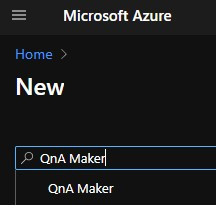
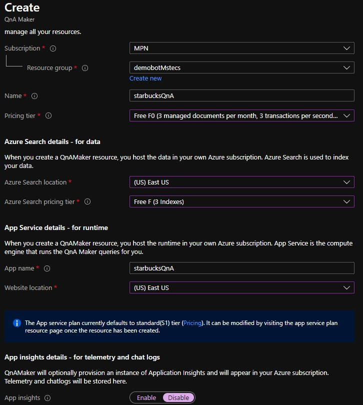
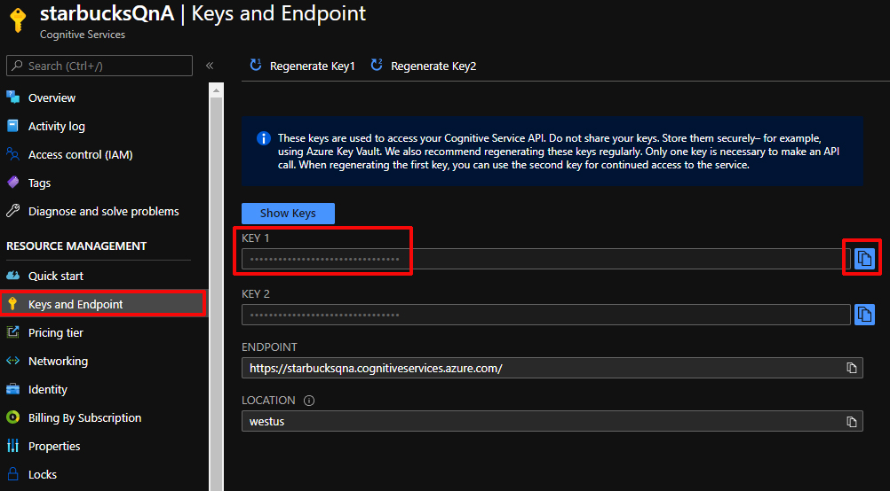
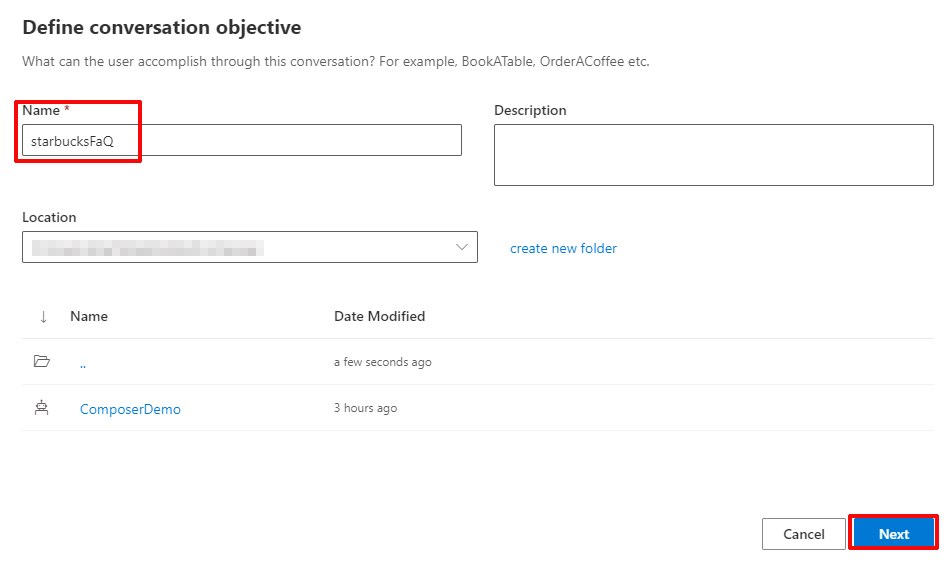
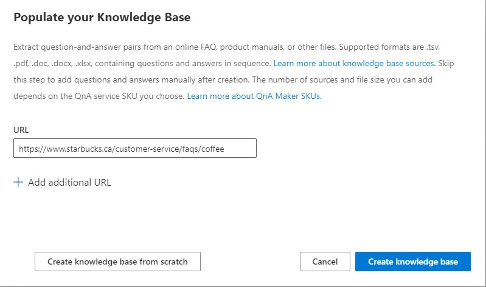
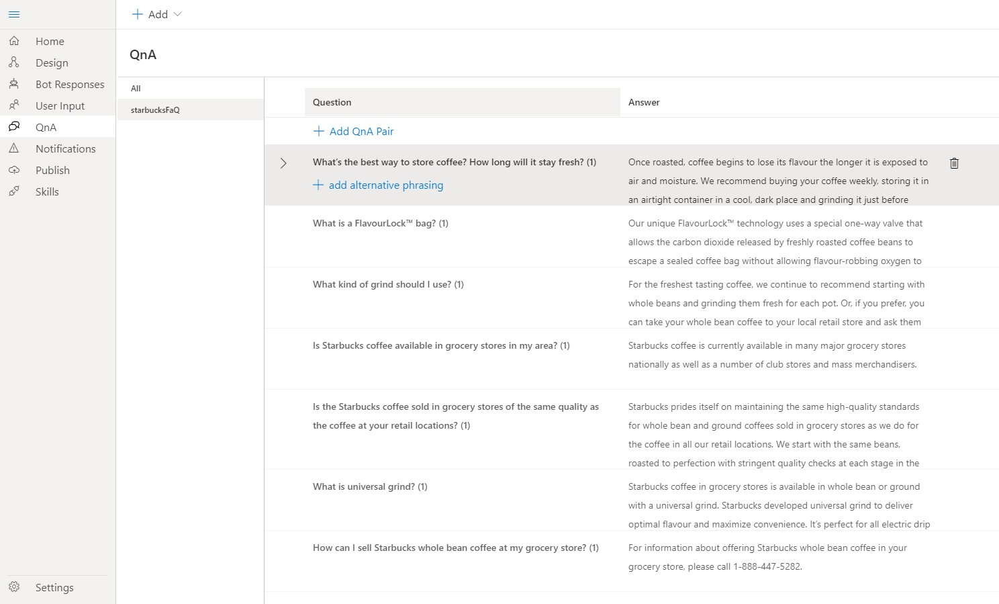
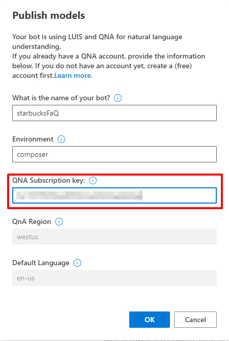
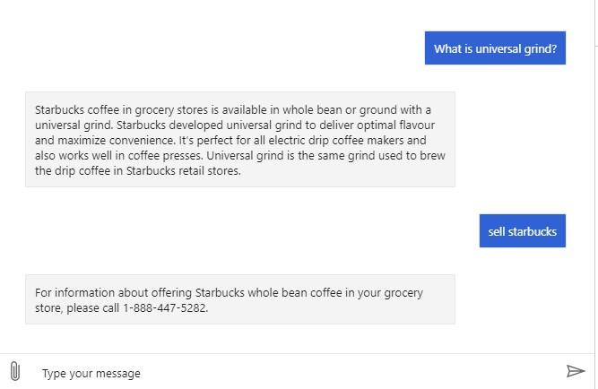

# DEMO: Bot and QnA

## Objectives

After you complete this demo, you will be able to:
- Create QnA service
- Create Knowledge base
- Create a Bot and use the Knowledge base

#### Exercise 1: Create your QnA service

##### Task 1: Open the Azure portal

1.  Sign in to the Azure portal (<https://portal.azure.com>).

##### Task 2: Create a QnA service

1. Click on **Create a resource** search *QnA Maker* and click on create

2. Create a new QnA Service with the following details:
   - Resource group: **starbucksdemoRG**
   - Name: **StarbucksQnA[yourname]**
   - Pricig tier: **Free F0**
   - Azure Search location: **East US**
   - Azure Search Pricing tier: **Free F**
   - App Name: **StarbucksQnA[yourname]**
   - Website location: **East US**
   - App insights: **Disable**

3. Wait for Azure to finish creating the QnA service
4. Go to your **QnA service** and record the **Key 1** in a text file, you can find this value in the **Keys and Enpoint** Section
    

#### Exercise 2: Create your bot and your Knowledge base

1. Open your **Bot Framework composer**
2. Click on **+ New** check **Create from knowledge base (QnA Maker)** then click on **Next** button
   

3. Set **starbucksFaQ** as name then click on **Next**
    

4. In the URL field add the following:
   ``https://www.starbucks.ca/customer-service/faqs/coffee``
5. Click on **Create knowledge base** and wait while is extracting the QnA pairs.
    

6. Now you can see the questions and the answers you can add more questions and answers
    

7. Now click on **Start Bot** and paste the **Key 1** previously recorded in the text file and click on **OK**
    

> **Note:** the publishing can take a few minutes

8. Test your bot in the Emulator by clicking in **Test in Emulator button** at the right top
    

9. Now you have a bot with a knowledge base. You can publish this bot using the same process that the previous demo