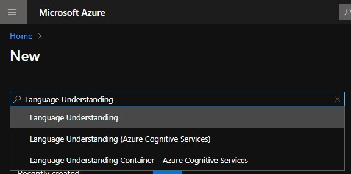
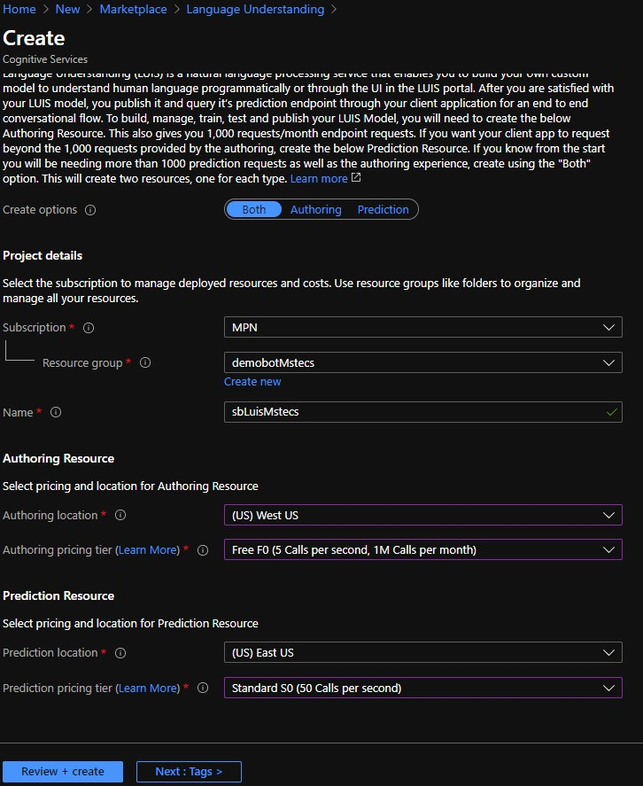
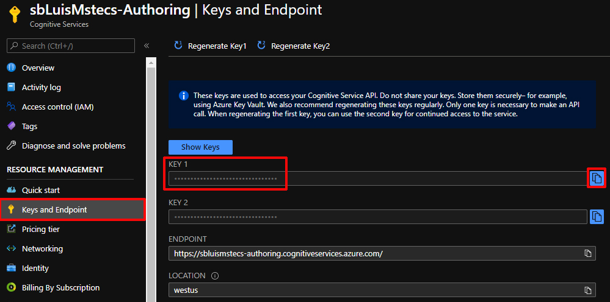
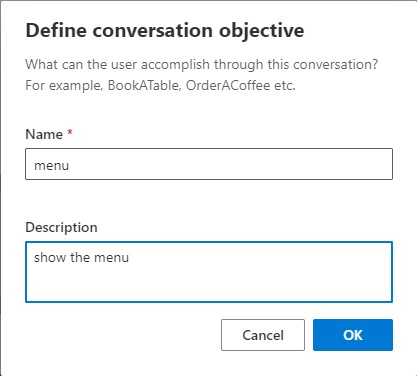
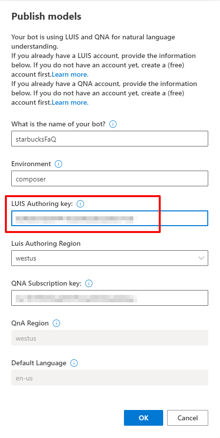
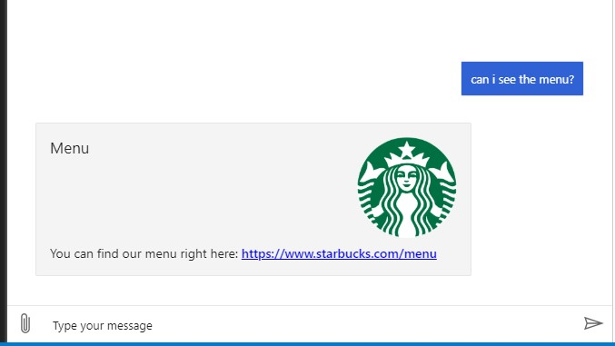

# DEMO: Enhace your bot with LUIS

## Objectives
After you complete this demo, you will be able to:
- Enhace your bot with LUIS capabilities

#### Exercise 1: Create your LUIS Service


##### Task 1: Open the Azure portal

1.  Sign in to the Azure portal (<https://portal.azure.com>).

##### Task 2: Create a LUIS Service

1. Click on **Create a resource** search *Language Undestanding* and click on create



2. Create a new QnA Service with the following details:
   - Create options: **Both**
   - Resource group: **starbucksdemoRG**
   - Name: **sbLuis[yourname]**
   - Authoring location: **West US**
   - Authoring pricing tier: **Free F0**
   - Prediction location: **East US**
   - Prediction pricing tier: **Standard S0**



3. Wait for Azure to finish creating the LUIS Service
4. Go to your **LUIS service** and record the **Key 1** in a text file, you can find this value in the **Keys and Enpoint** Section

    

#### Exercise 2: Add LUIS

##### Task 1: Create new dialog

1. Open your **starbucksFaQ** bot
2. Select **+ Add** and then select** Add new dialog** in the toolbar. A dialog will appear and ask for a Name and Description.
3. Fill in the **Name** field with **menu** and the **Description** field with **show the menu**





4. In the **BeginDialog** trigger, select the plus (+) icon in the **Authoring canvas** then select the **Send a response** action.
5. Select the **Send a response** node and enter the following text into the **Property panel**

   ```
   [ThumbnailCard
   title = Menu
   text = You can find our menu right here: https://www.starbucks.com/menu
   image = https://www.strategicmanagementinsight.com/img/company-logos/starbucks.png
   ]
   ```

##### Task 2: Connect your new dialog

1. Select **starbucksFaQ** in the navigation pane
2. In the toolbar select **+ Add** and then select **Add new trigger** to create a new trigger in the **starbucksFaQ** dialog.
3. Add the following language understanding training data in the **Create a trigger** form.
   - Select **Intent recognized** in the What is the type of this trigger field.
   - Enter **menu** in the **What is the name of this trigger(LUIS)** field.
   - Enter example utterances using the .lu file format in the **Trigger phrases** field.
     ```
     #menu
     - Show me the menu
     - Can you show me the menu?
     - what's in the menu?
     ```
4. In the **Properties pane** on the right hand, set the **Condition** property to ``#Menu.Score >= 0.5`` 

5. Click on **Start bot**
6. Composer needs to publish the LUIS model you created in the editor and needs your Key. Enter your LUIS key that you recorded in previous steps





7. Test your bot, try phrases like:
    - "Show me the menu"
    - "Can you show me the menu?"
    - "the menu please
    - "can i see the menu?"

