# DEMO: Enhace your bot with text analytics

## Objectives
After you complete this demo, you will be able to:
- Add to your bot the capability to detect the language
- Add to your bot the capability to detect sentiment


#### Exercise 1: Create a cognitive services resource

> **Note:** if you already have a **cognitive service** resource just record the **Key 1** in a text file, you can find this value in the **Keys and Enpoint** Section


##### Task 1: Open the Azure portal

1.  Sign in to the Azure portal (<https://portal.azure.com>).

##### Task 2: Create cognitive services resource

1. Click on **Create a resource** search *Cognitive services* select the first one and click on create

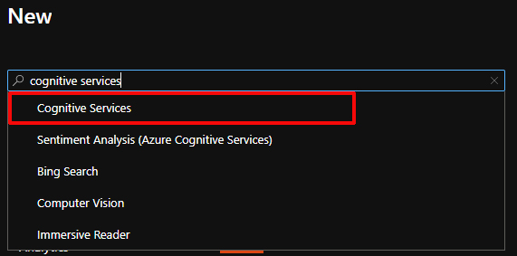

2. Create a new cognitive services with the following details:
   - Resource group: **starbucksdemoRG**
   - Region: **East US**
   - Name: **starbucksCs[yourname]**
   - pricing tier: **Standard S0**
   - Check the 2 boxes

---

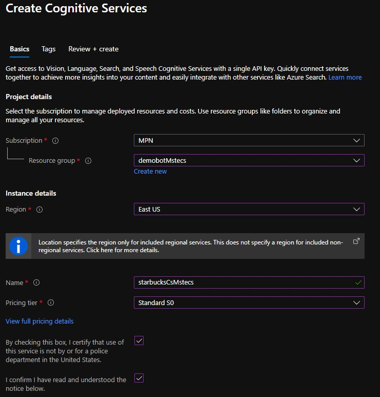


3. Wait for Azure to finish creating the cognitive services
4. Go to your **Cognitive services** resource and record the **Key 1** in a text file, you can find this value in the **Keys and Enpoint** Section

#### Exercise 2: Add language detection

##### Task 1: Create new dialog

1. Open your **starbucksFaQ** bot
2. Select **+ Add** and then select **Add new dialog** in the toolbar. A dialog will appear and ask for a Name and Description.
3. Fill in the **Name** field with **feedback** and the **Description** field with **leave some feedback**

4. In the **BeginDialog** trigger, select the plus (+) icon in the **Authoring canvas** then select the **Ask a question** and select **Text**

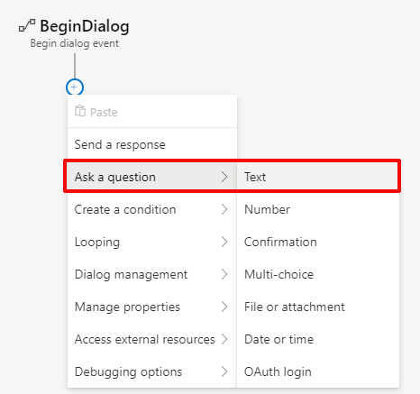

5. Click on **Bot Asks** node and enter the following text into the **Property panel**

   ```please leave your feedback :)```

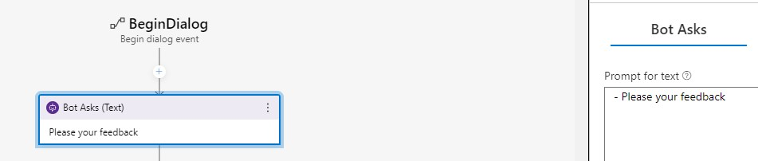

5. Click on **User Input** node and enter the following text into the **Property panel**

   ```user.feedback```

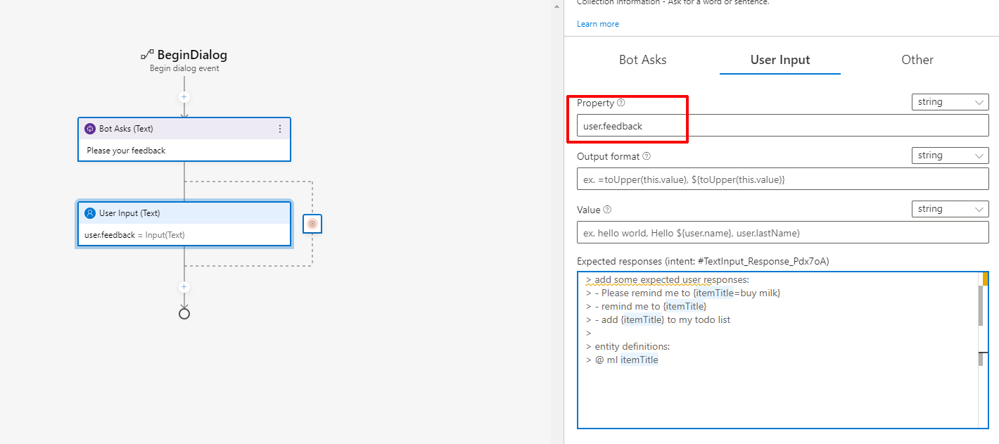

##### Task 2: Identify the language
> In order to detect the sentiment, first we need to detect the language. We are using two APIs to achieve this, one for identify the language and another to detect the sentiment

1. Select the plus (+) icon in the **Authoring canvas** then select the **Access external resources** and select **Send an HTTP request**

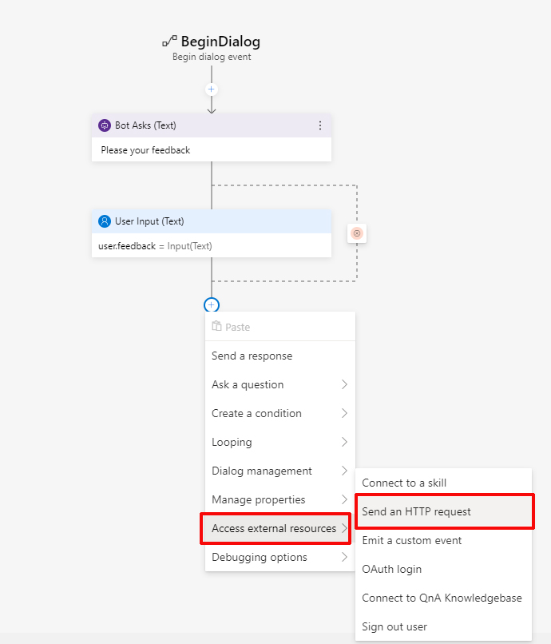

2. Configure the HTTP request with the following:
   - HTTP method: **POST**
   - Url: **https://eastus.api.cognitive.microsoft.com/text/analytics/v3.0/languages**
   - Body (object):
       ```json
       {
         "documents": [
           {
             "id": 1,
             "text": "${user.feedback}"
           }
         ]
       }
       ```
    - Headers:
      - Key: **Ocp-Apim-Subscription-Key**
      - String or expression: **[Your_Cognitive_Services_Key]**
    - Result property: **dialog.api_response**
    - Content type: **application/json**
    - Response type: **json**

> See the image belows

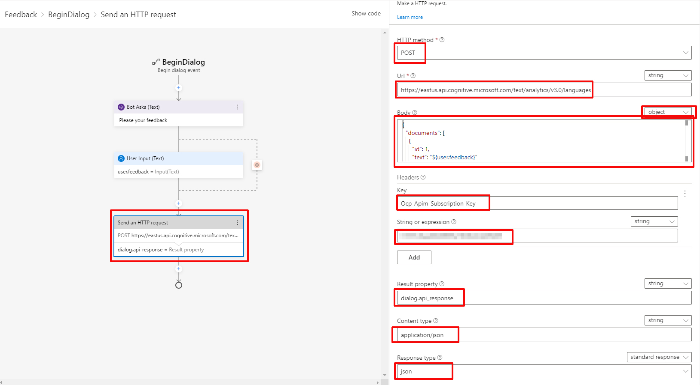

3. Select the plus (+) icon in the **Authoring canvas** then select the **Manage properties** and select **Set a property**

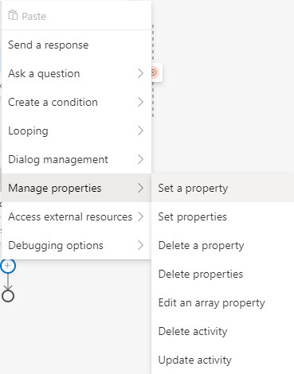

4. Select the **Set a property** node and add the following details
   - Property: **dialog.language**
   - Value: **=dialog.api_response.content**

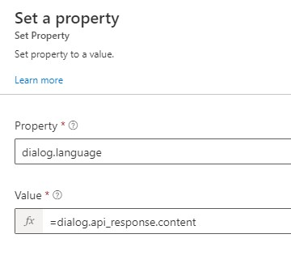

>**Review** This will consume a REST API and the content will store in memory in a variable called **dialog.language** below you can see an example response


```json
{
    "documents": [
        {
            "id": "1",
            "detectedLanguage": {
                "name": "English",
                "iso6391Name": "en",
                "confidenceScore": 1.0
            },
            "warnings": []
        }
    ],
    "errors": [],
    "modelVersion": "2020-09-01"
}
```

##### Task 3: Identify the language

1. Create another **HTTP Request** with the following details

   - HTTP method: **POST**
   - Url: **https://eastus.cognitiveservices.azure.com/text/analytics/v3.1-preview.1/sentiment**
   - Body (object):
       ```json
         {
           "documents": [
             {
               "language": "${dialog.language.documents[0].detectedLanguage.iso6391Name}",
               "id": "1",
               "text": "${user.feedback}"
             }
           ]
         }
       ```
    - Headers:
      - Key: **Ocp-Apim-Subscription-Key**
      - String or expression: **[Your_Cognitive_Services_Key]**
    - Result property: **dialog.api_response**
    - Content type: **application/json**
    - Response type: **json**

> See the image belows

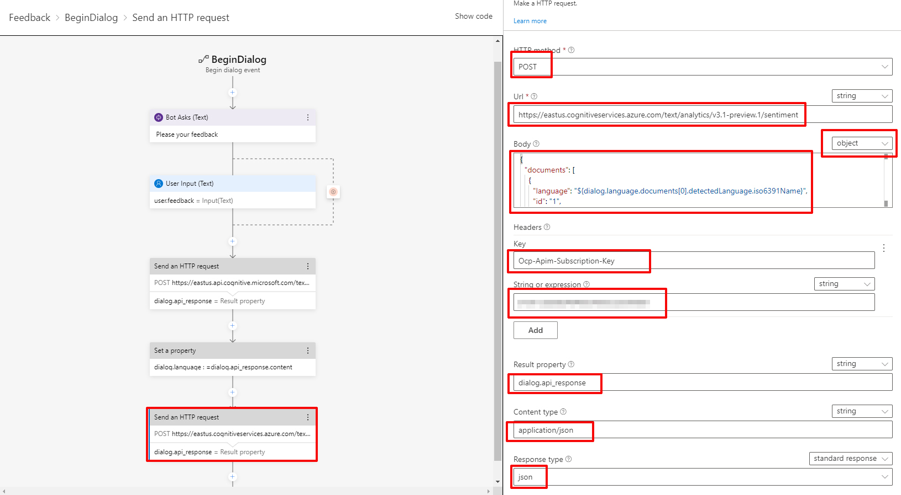

2. Select the plus (+) icon in the **Authoring canvas** then select the **Manage properties** and select **Set a property**


3. Select the **Set a property** node and add the following details
   - Property: **dialog.sentiment**
   - Value: **=dialog.api_response.content**

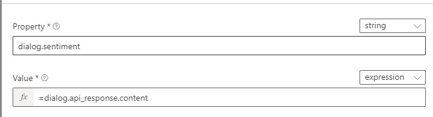

4. Select the plus (+) icon in the **Authoring canvas** then select the **Send a response**

5. Select the **Send a response** node and set the following in the property pane

```
[ThumbnailCard
   title = Thanks
   text = Thank you for you ${dialog.sentiment.documents[0].sentiment} feedback!
   image = https://www.strategicmanagementinsight.com/img/company-logos/starbucks.png
   ]
```

6. Select the plus (+) icon in the **Authoring canvas** then select the **Manage properties** then select **Delete properties**

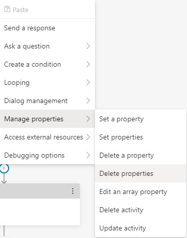

7. Set the following details:

    - dialog.sentiment
    - dialog.language
    - user.feedback

##### Task 4: Connect your dialog


1. Select **starbucksFaQ** in the navigation pane
2. In the toolbar select **+ Add** and then select **Add new trigger** to create a new trigger in the **starbucksFaQ** dialog.
3. Add the following language understanding training data in the **Create a trigger** form.
   - Select **Intent recognized** in the What is the type of this trigger field.
   - Enter **feedback** in the **What is the name of this trigger(LUIS)** field.
   - Enter example utterances using the .lu file format in the **Trigger phrases** field.
     ```
     #feedback
     - send feedback
     - give feedback
     - feedback
     ```
4. In the **Properties pane** on the right hand, set the **Condition** property to ``#Feedback.Score >= 0.8`` 

5. Click on **Start bot** and try your bot

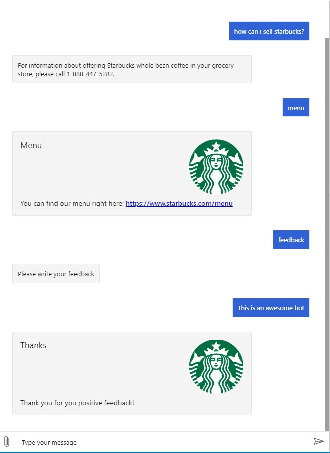

